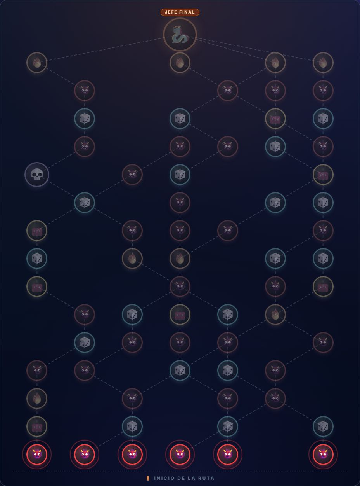
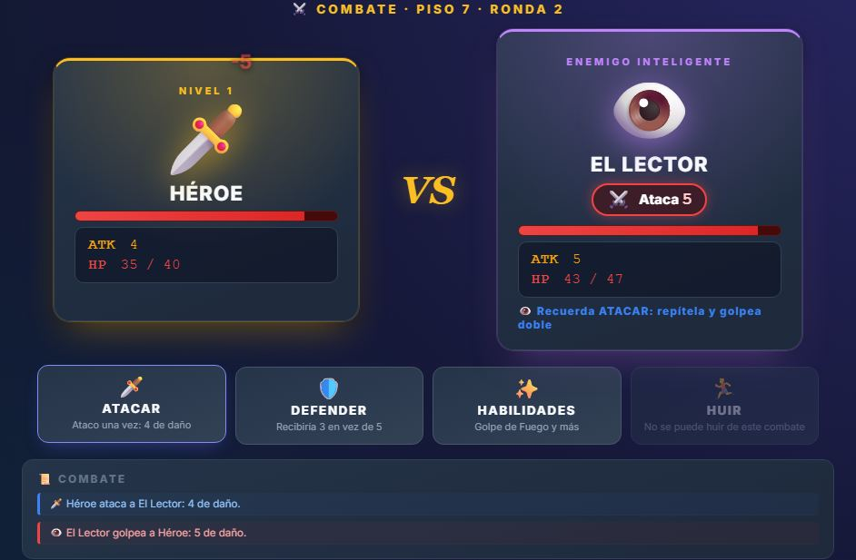
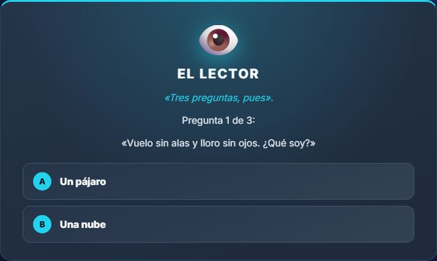

<div align="center">

# 🗡️ Easy Hero

### Elige tu ruta. Toma decisiones. Descubre quién eres.

*Un juego de aventuras por turnos que se juega en el navegador, en 25-40 minutos.*

<br>

[](https://harmondez.github.io/easy_hero/)

<br>


[Novedades](#-novedades) · [La idea](#-la-idea) · [Cómo se juega](#-cómo-se-juega) · [Tu héroe](#%EF%B8%8F-tu-héroe) · [Eventos](#-eventos-15-historias-2-decisiones) · [Estado](#-estado-del-juego) · [Qué viene](#-qué-viene)

</div>

---

## 🆕 Novedades

**Versión 1.0.2** · 22 de septiembre de 2026 · [ver el registro completo de cambios](CHANGELOG.md)

| | Qué hay de nuevo |
|:-:|------------------|
| 🎒 | **Equipo: 4 ranuras y 5 rarezas.** Arma, secundaria, armadura y accesorio, de ⚪ común a 🟠 legendaria |
| 🧰 | **Los cofres ya dan objetos de verdad**: eliges 1 de 3, comparas y decides equipar o descartar |
| 🔥 | La hoguera ahora ofrece **Descansar** o **Equiparte** (1 de 3 objetos) |
| ☠️🔥 | **Veneno y quemadura**: nuevos estados que hacen daño ronda a ronda |
| 👁️ | Ves lo que va a hacer el enemigo antes de elegir, y cada uno de los 15 monstruos ataca a su manera |
| 💾 | El guardado ahora incluye tu equipo y el botín a medio elegir |
| 🌱 | **Semilla**: cada ruta tiene un código y puedes repetirla, o escribir el tuyo |

---

## ✨ La idea

> [!IMPORTANT]
> **Todos empiezan con el mismo héroe.** No eliges clase al principio: **la descubres por las decisiones que tomas.**

Recorres un **mapa que se ramifica** y en cada paso eliges a dónde ir: un combate, un cofre, un evento o un peligro mayor.
Cada combate es por turnos, como en los grandes JRPG. Lo que decides por el camino convierte a tu héroe en guerrero,
pícaro o elementalista.

| ⏱️ Una partida | 🗺️ El mapa | ⚔️ El combate | 🌱 Tu héroe |
|:---:|:---:|:---:|:---:|
| **25-40 minutos** | Nuevo en cada partida | Por turnos, con menú | Cambia según tus elecciones |

---

## 🧭 Cómo se juega

<p align="center">
  
</p>

1. **🗺️ Elige tu camino.** Cada punto del mapa es un combate, un cofre, un evento, una hoguera o un sub-jefe. Avanzas hacia arriba, hasta el **jefe final**.
2. **⚔️ Combate por turnos.** Ves lo que va a hacer el enemigo **antes** de elegir, y decides: atacar, defenderte, usar una habilidad o huir.
3. **🔥 Recupera fuerzas.** En las hogueras puedes descansar o afilar tu arma. **Siempre hay una antes del jefe.**
4. **🎲 Decide en los eventos.** Te encuentras con una situación y **dos decisiones**. Ninguna sale gratis.
5. **💾 Retómalo cuando quieras.** El juego se guarda solo: cierras la pestaña y sigues justo donde lo dejaste.

### El combate

<p align="center">
  
</p>

| Acción | Qué hace |
|--------|----------|
| 🗡️ **Atacar** | Golpeas una vez |
| 🛡️ **Defender** | El golpe de esta ronda hace la mitad. Solo sirve si el enemigo va a atacar |
| ✨ **Habilidades** | Golpe de Fuego: 5 de daño, tarda 3 rondas en volver a estar listo |
| 🏃 **Huir** | Sales del combate (te hacen daño al irte). No se puede huir de sub-jefes ni de jefes |

#### 👁️ Ves lo que va a hacer el enemigo

Sobre cada enemigo aparece **su próximo movimiento**, y ese movimiento es exactamente el que hará. Así, Defender deja de ser una apuesta y pasa a ser una decisión.

| Lo que ves | Qué significa |
|:----------:|---------------|
| ⚔️ **Ataca 5** | Te hará 5 de daño |
| 💥 **Golpe fuerte 9** | Un golpe grande: es el momento de defenderte |
| ⚡ **Reúne fuerzas** | No ataca ahora, pero prepara algo fuerte |
| 🛡️ **Se protege** | Este turno recibirá la mitad de daño |
| 💚 **Se cura** | Recupera vida |
| 💤 **Descansa** | No hace nada |

Cada uno de los **15 monstruos** tiene su forma de atacar: el Goblin carga y golpea fuerte, el Esqueleto se protege, el Murciélago se cura…

---

## 🛡️ Tu héroe

Empiezas con **ATK 1** (tu fuerza de ataque) y **25 de vida**. Nada más. A partir de ahí depende de ti.

### Tres estilos, seis tipos de daño

Tu estilo no se elige: **se revela** según lo que recoges y decides. Cada estilo domina dos tipos de daño.

| | Estilo | Cómo se juega | Tipos de daño |
|:---:|--------|---------------|---------------|
| 🛡️ | **Guerrero** | Aguante y golpes contundentes | 🗡️ Filo · 🔨 Contundente |
| 🏹 | **Pícaro** | Rapidez, críticos y venenos | 🏹 Perforante · ☠️ Veneno |
| 🔥 | **Elementalista** | Poder elemental | 🔥 Fuego · ⚡ Rayo |

> [!TIP]
> Mezclar estilos está permitido, y a veces es la mejor jugada.

### 🎒 Tu equipo

Llevas **4 objetos**, sin mochila ni líos: cuando encuentras uno, decides al momento si te lo pones (pierdes lo que llevabas en esa ranura) o lo descartas (te cura).

| Ranura | Qué aporta |
|--------|-----------|
| ⚔️ **Arma principal** | Tu fuerza y **el tipo de daño de tus golpes** (Filo, Contundente, Perforante, Veneno, Fuego o Rayo) |
| 🛡️ **Escudo, arma o foco** | Defender mejor, un golpe extra o habilidades más potentes |
| 🧥 **Armadura** | Más vida y un efecto especial |
| 💍 **Accesorio** | Un efecto pasivo |

Los objetos tienen **5 rarezas**: ⚪ común · 🟢 poco común · 🔵 rara · 🟣 épica · 🟠 legendaria (esta última con un rasgo único).
Cuanto más rara, más efectos trae, y cuanto más profundo lo encuentras, más fuerte es. Los encuentras en **cofres**, **hogueras** (mínimo 🟢) y **sub-jefes** (mínimo 🔵), siempre eligiendo 1 de 3.

---

## 🎲 Eventos: 15 historias, 2 decisiones

En el camino te esperan **situaciones con dos decisiones**. Cada una cuesta algo o arriesga algo, y **no se repiten en la misma partida**.

<p align="center">
  
</p>

<details>
<summary><b>👀 Ver los 15 eventos (contiene pequeños adelantos)</b></summary>

<br>

| | Evento | La situación |
|:-:|--------|--------------|
| 🩹 | **La chica herida** | Alguien te pide ayuda en plena mazmorra… ¿confías? |
| 🥷 | **El extraño encapuchado** | Dice conocer un camino seguro |
| 📦 | **El cofre susurrante** | Murmura tu nombre |
| 🏕️ | **El campamento abandonado** | Brasas calientes y nadie a la vista |
| 🪞 | **El espejo oscuro** | Tu reflejo se mueve solo |
| 🗿 | **La estatua del caballero caído** | Sostiene una espada con un brillo extraño |
| ⛲ | **El pozo de los deseos** | Salud o poder, pero no las dos |
| 🌉 | **El puente de cuerdas** | Acorta el camino, si aguanta |
| 🚪 | **La puerta sellada** | Solo los fuertes la abren |
| ⚗️ | **El alquimista errante** | Una pócima sin etiqueta |
| 🪨 | **El derrumbe** | Solo puedes salvar a una persona |
| ⚖️ | **El juicio de las hermanas** | Una de las dos miente |
| 🤞 | **El voto** | Poder a cambio de renunciar a algo para siempre |
| 🥋 | **El maestro errante** | Una sola lección: cuerpo o llama |
| 👁️ | **El Lector** | Tres preguntas… o un combate contra un enemigo que lee tus movimientos |

</details>

---

## 🚧 Estado del juego

> [!NOTE]
> **Versión 1.0.2, sigue en desarrollo.** El equilibrio ya está ajustado para que un jugador medio **gane algo más de 1 de cada 5 partidas**
> (todo el detalle, medido con miles de partidas simuladas, está en [docs/equilibrio.md](docs/equilibrio.md)). Cambiará a medida que se añadan cosas.

### ✅ Ya se puede jugar

- 🗺️ Mapa de **16 pisos** que cambia en cada partida
- ⚔️ Combate por turnos: atacar, defender, habilidad y huir
- 🎒 **Equipo de 4 ranuras y 5 rarezas**, con 122 objetos y 24 afijos (ver más abajo)
- 👁️ **Ves lo que va a hacer cada enemigo** antes de elegir, y **15 monstruos** con su propia forma de atacar
- 🔥 **Hogueras** para descansar o equiparte, con una siempre antes del jefe
- 🎲 **15 eventos** con dos decisiones cada uno
- 💀 Sub-jefes **opcionales** (siempre hay un camino sin ellos), cofres con botín y un jefe final
- 🧠 Un enemigo especial, **El Lector**, que aprende de lo que haces
- 🤞 Promesas que cambian tu forma de jugar (por ejemplo, renunciar a huir)
- 💾 **Guardado automático**: cierra la pestaña y continúa donde lo dejaste
- 🏁 **Pantalla final** con tu resumen y la línea de «casi»: cuánto te faltó
- 🌱 **Semilla**: cada ruta tiene un código; con el mismo código y las mismas decisiones, la partida se repite igual
- 📱 Funciona en móvil y en ordenador

### 🔜 En camino

Todo lo que viene está explicado, con sus motivos, en **[planning.md](planning.md)**.

---

## 🔮 Qué viene

Lo haremos en **cuatro entregas**. Empezamos por hacer el juego **ganable y claro**, y después añadimos profundidad.

| Entrega | Nombre | Qué trae |
|:-------:|--------|----------|
| **A** ✅ | 🎯 **Jugable** | **Hecha (1.0.1).** Ver qué va a hacer cada enemigo · Hogueras · Dificultad ajustada a **ganar 1 de cada 5** · Guardado de partida, semilla y pantalla final |
| **B** 🚧 | 🎒 **Tu build** | **Equipo hecho (1.0.2):** 4 ranuras y 5 rarezas. Falta elegir 1 de 3 mejoras tras cada combate y **despertar como clase** |
| **C** | 💥 **Táctico** | Debilidades y **Ruptura** (rompe al enemigo y actúa otra vez) · Combates con varios enemigos y orden de turnos |
| **D** | 📖 **A largo plazo** | Bestiario, logros y el **Legado** de tu héroe caído · Niveles de riesgo para los que ya ganaron |

### 💡 Algunas ideas que nos hacen ilusión

- **Romper al enemigo cancela su ataque.** Verás el golpe fuerte que viene y podrás romperlo antes de que caiga.
- **El Legado.** Si tu héroe cae, otra partida puede encontrar su tumba y recuperar uno de sus objetos.
- **Tu arma cambia contra quién eres fuerte.** Otra arma, otro tipo de daño, otra ruta.
- **La ruta del día.** El mismo mapa para todos, para comparar quién llega más lejos.

---

## 📚 Para saber más

| Documento | Qué cuenta |
|-----------|-----------|
| 📋 [planning.md](planning.md) | **El plan completo** de lo que viene y por qué |
| 📜 [Registro de cambios](CHANGELOG.md) | Qué trae cada versión del juego |
| 🏷️ [Versiones](docs/versiones.md) | Cómo se numeran y se publican las versiones |
| 🎲 [Eventos](docs/eventos.md) | Los 15 eventos con todos sus resultados |
| ⚖️ [Equilibrio](docs/equilibrio.md) | Cómo se ajusta la dificultad y dónde está ahora |
| 🔎 [Cómo funcionan los juegos de este género](jrpg-trend.md) | La investigación que guía el diseño |
| 📖 [Diseño de sistemas RPG](Diseño%20de%20Sistemas%20RPG%20Minimalista.md) | Investigación complementaria |
| 🧪 [Cómo lo comprobamos](test-method.md) | Cómo verificamos que todo funciona |

---

## 🛠️ Para quien quiera colaborar

<details>
<summary><b>💻 Probarlo en tu ordenador</b></summary>

<br>

Necesitas tener **Node.js** y **Python** instalados. Desde la carpeta del proyecto:

```bash
npm run dev      # abre el juego en http://127.0.0.1:8770
```

</details>

<details>
<summary><b>✅ Comprobar que todo funciona</b></summary>

<br>

```bash
npm install                        # solo la primera vez
npx playwright install chromium    # solo la primera vez
npm test                           # ejecuta todas las comprobaciones
```

Son 532 comprobaciones automáticas. Las de la lógica del juego tardan unos segundos; la del navegador, un par de minutos.

Para ver cómo está el equilibrio: `npm run balance` juega miles de partidas simuladas y cuenta cuántas llegan al jefe.

</details>

<details>
<summary><b>🏷️ Publicar una versión nueva</b></summary>

<br>

```bash
npm run release              # ¿está todo sincronizado con la versión actual?
npm run release -- patch     # 1.0.2 → 1.0.3  (también minor o major)
```

Cambia la versión en todos los sitios a la vez y prepara el registro de cambios. Los pasos completos están en [docs/versiones.md](docs/versiones.md).

</details>

<details>
<summary><b>📁 Qué hay en cada carpeta</b></summary>

<br>

```text
├── index.html      La página del juego
├── style.css       El aspecto
├── src/            La lógica del juego, los eventos y sus textos
├── tests/          Las comprobaciones automáticas
└── docs/           Documentación e imágenes
```

</details>

---

<div align="center">

**[▶ Jugar ahora](https://harmondez.github.io/easy_hero/)** · Gratis · Sin instalar nada · En español

</div>
