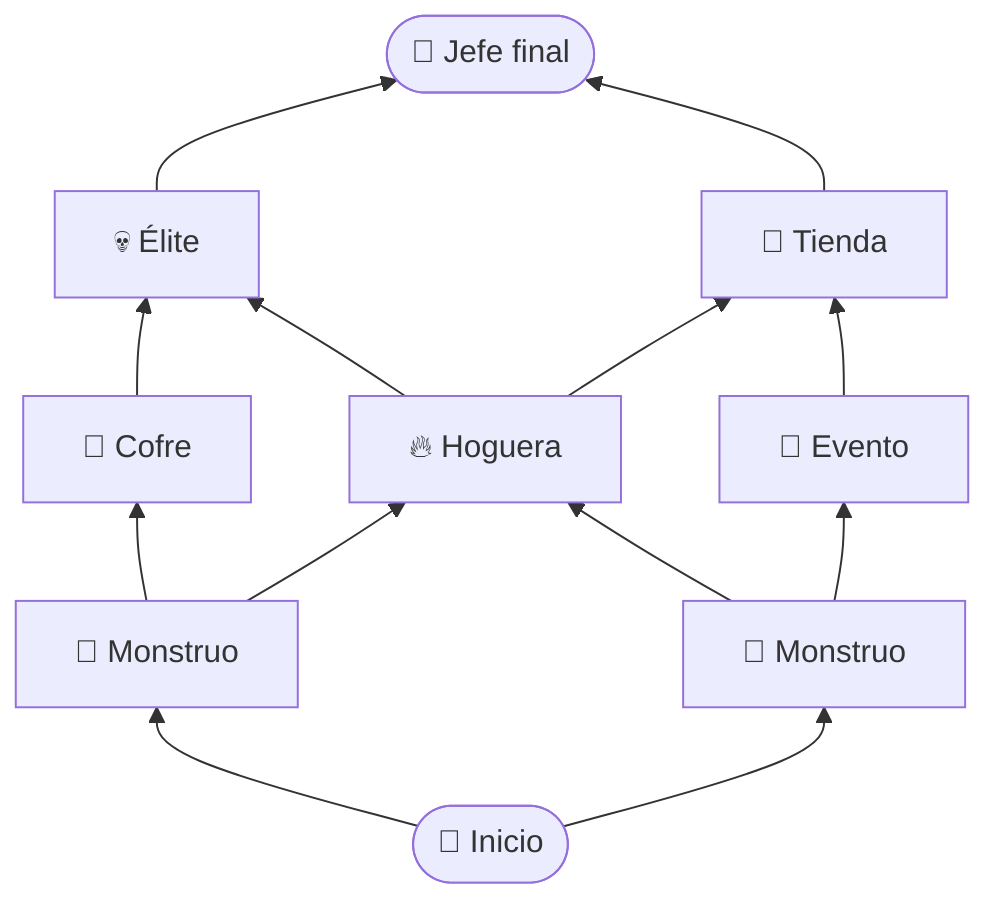

<div align="center">

# 🗡️ Easy Hero

### Roguelike de ruta con combate JRPG por turnos

*Minimalista en forma. Denso en decisiones.*

<br>

[](https://harmondez.github.io/easy_hero/)

<br>


[Idea](#-la-idea) · [Cómo se juega](#-cómo-se-juega) · [Estilos](#%EF%B8%8F-tres-estilos-seis-tipos-de-daño) · [Estado](#-estado-actual) · [Hoja de ruta](#%EF%B8%8F-hoja-de-ruta) · [Desarrollo](#-desarrollo)

</div>

---

## ✨ La idea

> [!IMPORTANT]
> **Todos empiezan con el mismo héroe.** No hay pantalla de elegir clase: **la clase emerge de tus decisiones.**

Recorres una **ruta que se ramifica** como en *Slay the Spire*. Cada combate es un pequeño puzle de **JRPG por turnos** al estilo *Octopath Traveler*: lees las debilidades del enemigo, rompes su escudo y aprovechas el turno libre.

| ⏱️ Partida | 🗺️ Mapa | ⚔️ Combate | 🌱 Progreso |
|:---:|:---:|:---:|:---:|
| **25–40 min** | Procedural, con caminos que se bifurcan | Por turnos, hasta 3 enemigos | La clase surge de tus elecciones |

---

## 🧭 Cómo se juega



1. **🗺️ Elige tu ruta.** El mapa te muestra a qué te enfrentarás. Ir a lo seguro o arriesgarte por mejor botín es una decisión real.
2. **⚔️ Combate por turnos.** Menú clásico: **Atacar · Defender · Habilidades · Huir**, con un **orden de turnos visible**.
3. **💥 Rompe al enemigo.** Cada enemigo tiene un escudo y **debilidades**. Golpéalas para romperlo: pierde su turno y recibe más daño.
4. **🌱 Crece a tu manera.** Lo que eliges te da **afinidad** con un estilo y desbloquea habilidades y sinergias.

---

## ⚔️ Tres estilos, seis tipos de daño

La clase no se elige: se **descubre**. Los enemigos son débiles a tipos distintos, así que **tu build condiciona qué ruta te conviene**.

| | Estilo | Filosofía | Daño |
|:---:|---|---|---|
| 🛡️ | **Guerrero** | Aguante, defensa y golpes contundentes | 🗡️ Filo · 🔨 Contundente |
| 🏹 | **Pícaro** | Velocidad, críticos y venenos | 🏹 Perforante · ☠️ Veneno |
| 🔥 | **Elementalista** | Daño elemental y control | 🔥 Fuego · ⚡ Rayo |

> [!TIP]
> Mezclar familias está permitido, y a veces es la mejor jugada.

### 📊 Atributos

| **ATK** | **HP** | **DEF** | **SPD** | **MP** |
|:---:|:---:|:---:|:---:|:---:|
| Daño | Vida | Reducción | Orden de turno | Coste de habilidades |

Los monstruos empiezan débiles y **escalan a medida que avanzas**.

---

## 🧱 Principios

- 🎨 **Minimalista** — emojis y CSS. Cero imágenes, cero assets.
- 🧠 **Denso** — la profundidad viene de los sistemas y del contenido, no del arte.
- 🗃️ **Contenido como datos** — enemigos, habilidades y eventos viven aparte del motor.
- 🎲 **Reproducible** — motor puro con aleatoriedad por semilla: cualquier ruta se puede repetir y probar.

---

## 🚧 Estado actual

> [!NOTE]
> Es un **prototipo**: el bucle básico ya funciona y el resto está por construir.

| | Pieza |
|:---:|---|
| ✅ | Mapa procedural (10 pisos, caminos que no se cruzan) |
| ✅ | Nodos de monstruo, cofre, sub-jefe y jefe final |
| ✅ | Combate por turnos 1 contra 1 con menú |
| ✅ | Escalado de monstruos por piso |
| ⬜ | Orden de turnos, SPD y MP |
| ⬜ | Varios enemigos, debilidades y Ruptura |
| ⬜ | Afinidades y clases emergentes |
| ⬜ | Hogueras, eventos y tiendas |
| ⬜ | Guardado de partida |

## 🗺️ Hoja de ruta

| Hito | Contenido |
|:---:|---|
| **M0** | Base: semilla aleatoria, guardado y pantalla final |
| **M1** | Núcleo de combate: SPD, MP, varios enemigos, elementos, debilidades y Ruptura |
| **M2** | Contenido y builds: enemigos, habilidades y afinidades como datos; recompensa «elige 1 de 3» |
| **M3** | Más nodos: hoguera, evento, tienda y élite |
| **M4** | Equilibrio, resumen de partida y semillas compartibles |

---

## 🛠️ Desarrollo

<details>
<summary><b>🚀 Ejecutarlo en local</b></summary>

<br>

Necesita servirse por HTTP (los módulos ES no funcionan con `file://`):

```bash
npm run dev    # http://127.0.0.1:8770
```

</details>

<details>
<summary><b>🧪 Tests</b></summary>

<br>

```bash
npm install                        # solo la primera vez
npx playwright install chromium    # solo la primera vez
npm run test:engine                # lógica pura: héroe, monstruos, mapas, combate
npm run test:browser               # partida completa en el navegador
npm test                           # ambos
```

</details>

<details>
<summary><b>📁 Estructura del proyecto</b></summary>

<br>

```text
├── index.html        Página única
├── style.css         Estilo del juego
├── src/
│   ├── engine.js     Lógica pura, sin DOM
│   ├── ui.js         Presentación
│   └── main.js       Estado de la partida y eventos
├── tests/            Tests del motor y del navegador
└── docs/             Notas de diseño
```

Las reglas y números actuales del prototipo están en [`docs/prototipo-v0.md`](docs/prototipo-v0.md).

</details>

---

<div align="center">

**[▶ Jugar ahora](https://harmondez.github.io/easy_hero/)** · JavaScript vanilla · sin build · hecho para GitHub Pages

</div>
