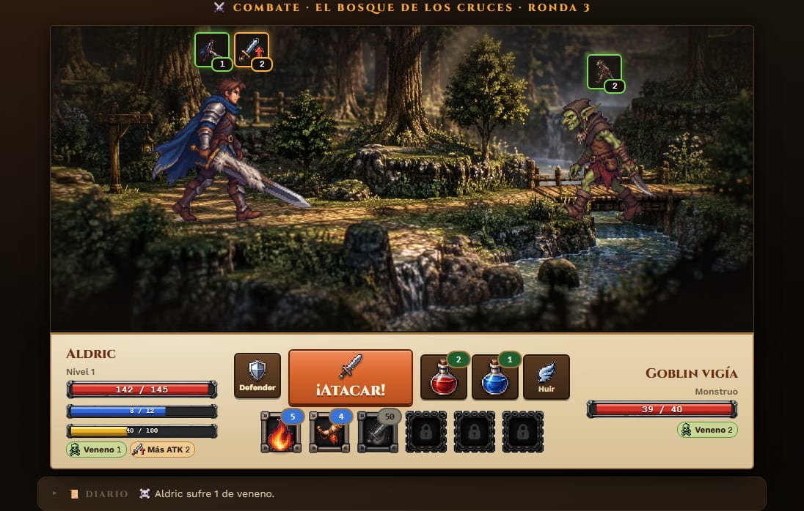
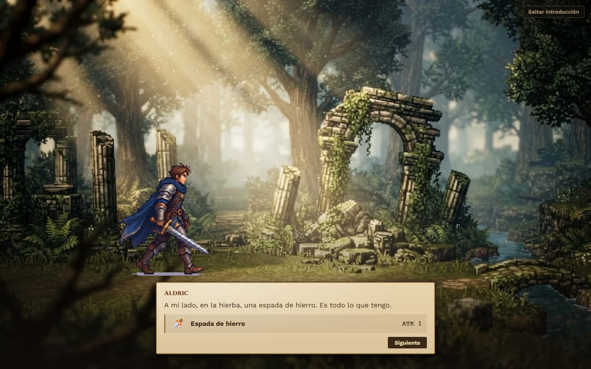
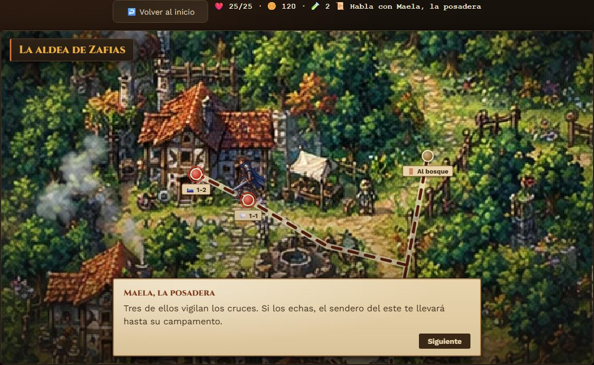
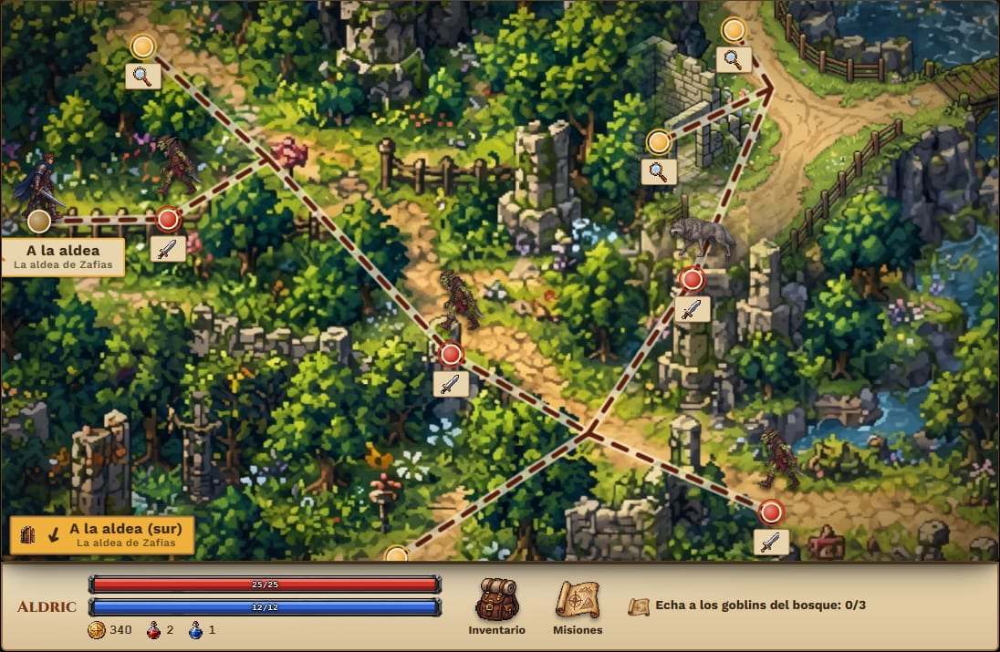
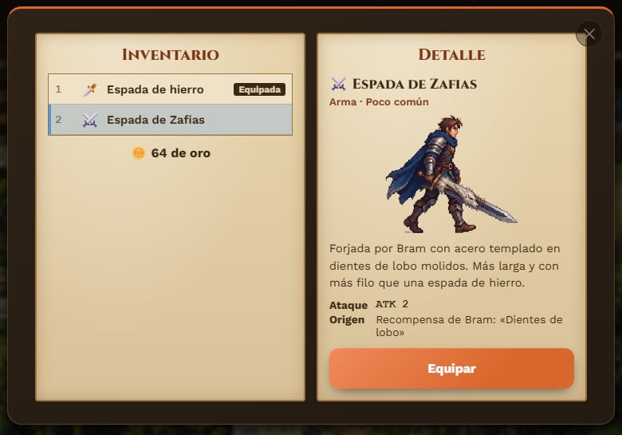
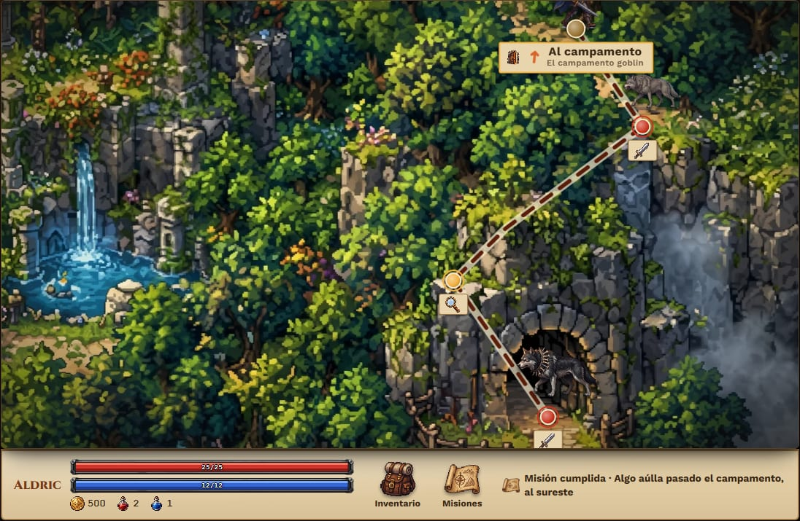
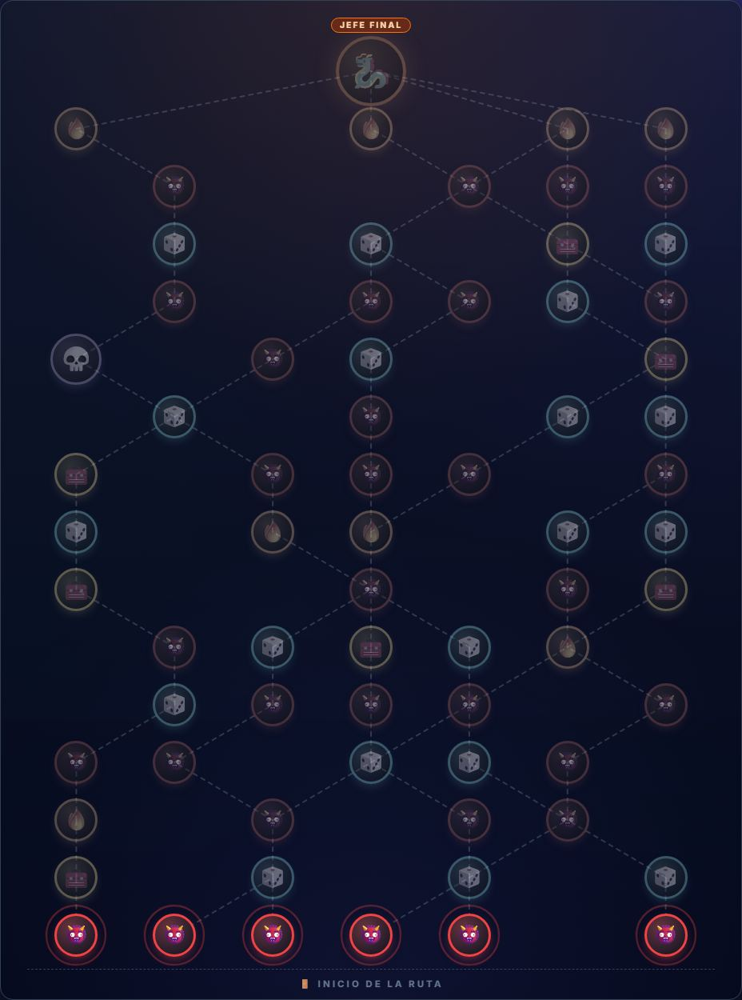
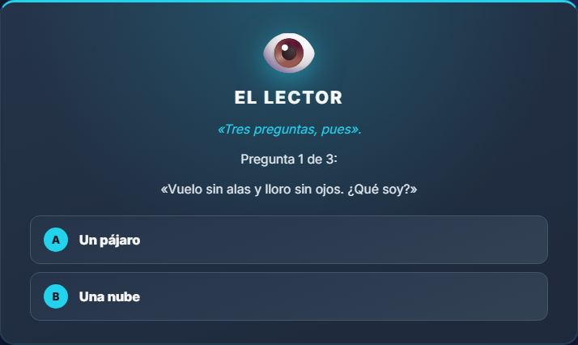

<div align="center">

# 🗡️ Easy Hero

### Despierta sin memoria. Explora Zafias. Pelea de tú a tú.

*Un RPG por turnos que se juega en el navegador, con el alma de los clásicos como DragonFable:
una aldea con encargos, combates de lado, armas que cambian a tu héroe… y una mazmorra sin fondo para los valientes.*

<br>



<br>

[](https://harmondez.github.io/easy_hero/)

<br>


[Novedades](#-novedades) · [La idea](#-la-idea) · [Modo aventura](#-modo-aventura-zafias) · [Cómo se juega](#-cómo-se-juega) · [Tu héroe](#%EF%B8%8F-tu-héroe) · [Eventos](#-eventos-15-historias-2-decisiones) · [Estado](#-estado-del-juego) · [Qué viene](#-qué-viene)

</div>

---

## 🆕 Novedades

**Versión 1.8.0** · 2 de octubre de 2026 · [ver el registro completo de cambios](CHANGELOG.md)

> [!IMPORTANT]
> **La aventura es ahora el corazón de Easy Hero.** Entras directamente en ella: despiertas sin memoria en unas
> ruinas, caminas hasta Zafias y allí empieza todo — misiones, un diario para seguirlas y tu primera espada de
> verdad. La mazmorra sin fondo sigue ahí, a un clic, para cuando quieras bajar.

| | Qué hay de nuevo |
|:-:|------------------|
| 🌅 | **Nuevo en la 1.8.0 — Una introducción y entrada directa a la aventura:** despiertas sin memoria en unas ruinas del bosque, recuerdas tu nombre, encuentras tu espada de hierro y caminas hasta Zafias. Desde entonces, el juego te lleva directo a la aventura |
| ⚔️ | **Nuevo en la 1.8.0 — Tu primer objeto: la Espada de Zafias.** Tráele a Bram cinco dientes de lobo y te forjará una espada con el doble de ataque. Cada espada cambia el dibujo de tu héroe, y todo lo guardas en un **inventario** al estilo DragonFable |
| 📜 | **Nuevo en la 1.8.0 — Diario de misiones:** la misión principal y las secundarias, con su progreso; las cumplidas, tachadas. Los NPC con un encargo salen en azul, y Bram te pide cinco dientes de lobo |
| 🚪 | **1.7.1 — Salidas que se encuentran y criaturas a su tamaño:** carteles dorados con flecha hacia cada salida (si no se ve, te espera en el borde de la pantalla), lobos a media altura de tu héroe y un Feronius grande que ya no llena la pantalla |
| 🐺 | **1.7.0 — Feronius el Feroz, el jefe de Zafias:** vence a Grask y se abre **la guarida del lobo**, al fondo del barranco. El lobo alfa te espera en la boca de su cueva |
| 🗺️ | **1.7.0 — Zafias en alta resolución y mucho más grande:** el mapa rehecho y nítido, **28 paradas** en vez de 10, lobos en el bosque y una segunda salida de la aldea |
| 🔍 | **1.7.0 — Puntos de interés:** paradas doradas que se miran en vez de pelearse. Algunas esconden oro o una poción la primera vez: el pozo, un fardo en la orilla, el botín de Grask… |
| ⚖️ | **1.7.0 — Zafias se puede terminar empezando de cero:** Grask es un primer muro de verdad, pero ya no hace falta entrenar durante horas |
| 🎨 | **1.6.0 — Enemigos con dibujo propio:** el **Orco** y **Grask, el jefe goblin**, ya no son el goblin teñido. Grask te espera en el campamento, más grande que tú |
| 🏭 | **1.6.0 — Fábrica de arte:** el juego ya puede crear enemigos, jefes, fondos y mapas con un mismo estilo de pixel art. Pronto, cada criatura con su imagen |
| 🗺️ | **Zafias como un mapa antiguo:** caminos a trazos de tinta y paradas rojas que laten, numeradas **1-1, 1-2, 1-3…**. Tu héroe anda de parada en parada; un enemigo sin vencer corta el paso y, vencido, su parada queda con ✓ |
| 🧭 | **Modo aventura: Zafias.** Un mapa pintado que recorres escena a escena con tu héroe de siempre: una aldea con sus vecinos, un bosque lleno de goblins y un campamento con su jefe |
| 📜 | **Tu primera misión.** Maela, la posadera, te encarga limpiar el bosque. El objetivo siempre a la vista y una recompensa al volver |
| ⚔️ | **Combate de lado**, como en los clásicos del navegador: tu héroe a la izquierda, el enemigo a la derecha. Cada golpe es una **embestida** y el daño salta encima del golpeado |
| 📜 | **Panel de pergamino**: tu vida, la del enemigo y un gran **¡Atacar!** en el centro, con el resto de acciones a un clic |
| 🌬️ | **El enemigo ya no anuncia lo que hará.** Hay que aprender a leerlo: antes de un golpe fuerte lo verás tensarse y brillar en rojo |
| 🧪 | **Pociones**: curan el 40 % de tu vida a cambio del turno. Llevas hasta 3 y no se pierden entre partidas |
| 🏘️ | **La aldea funciona**: duerme en la **posada** para curarte, compra en la **tienda** y baja a la mazmorra por la **cueva del sur** |
| 🎨 | Cada especie de monstruo tiene su color, y los jefes se ven más grandes |

<details>
<summary><b>📦 Lo que trajeron las versiones anteriores (1.4.x)</b></summary>

<br>

| | Qué hay de nuevo |
|:-:|------------------|
| 🗺️ | **El mapa en el centro, en grande**: tu equipo a un lado y tu personaje (vida, nivel, primarias, oro) al otro, siempre a la vista mientras exploras |
| 🔥 | **Una mazmorra de verdad**: túneles curvos excavados en la roca, salas desalineadas y una antorcha que ilumina dónde estás. Lo lejano es oscuridad |
| ⚔️ | **El equipo siempre a la vista**, junto al mapa y junto al botín: nunca hace falta abrir nada para ver qué llevas puesto ni para compararlo |
| 🎁 | **El botín ya no se elige 1 de 3**: cae un solo objeto. Los combates normales también sueltan algo de vez en cuando, casi siempre común; lo bueno se gana en cofres y sub-jefes |
| 🕳️ | **El descenso no tiene fin**: vencer al jefe ya no acaba la partida. El suelo se abre y bajas a otro tramo, más duro y más rico. Tu marca es la **profundidad** |
| ⚒️ | **La Forja**: por fin hay dónde gastar el oro. 8 mejoras **permanentes** que no se pierden al morir |
| 🧬 | **Variantes de monstruo**: «Orco Colérico de la Plaga». 22 formas raras que cambian cómo pelea |
| 👾 | **90 monstruos y 6 jefes**: cada tramo del descenso estrena criaturas que no has visto |
| ⛏️ | **Expedición**: la mazmorra rinde oro mientras no juegas, hasta 8 horas |
| 🌫️ | **Niebla de guerra**: el mapa se recorre hacia abajo desde el piso 0 y lo que queda a más de 3 pisos por delante se cubre hasta que te acercas |
| 🧬 | **Estadísticas primarias**: Fuerza, Destreza, Inteligencia y Vitalidad, con crítico, esquiva y resistencia de verdad |
| 📈 | **Nivel de personaje, permanente**: gana experiencia, sube de nivel y reparte tú mismo los puntos — te acompaña en todas tus rutas futuras |
| 🪙 | **Oro**: los monstruos dejan monedas al vencerlos; se acumula para siempre, incluso si mueres |
| 🐉 | **El trofeo del jefe**: vence al Dragón Ancestral y te quedas con un objeto legendario para todas tus rutas futuras |
| 🏰 | **Nueva ambientación**: fantasía oscura de mazmorra, piedra y forja en vez del azul genérico de antes |
| 📖🎒🏆 | **Bestiario, colección y 15 logros**, accesibles desde el menú de la cabecera |

</details>

---

## ✨ La idea

> [!IMPORTANT]
> **Un héroe sin pasado y un mundo por descubrir.** Despiertas en unas ruinas con una espada de hierro y tu nombre.
> Todo lo demás —quién eres, qué arma llevas, en qué te conviertes— lo vas ganando en el camino.

Recorres Zafias **escena a escena** sobre un mapa pintado: hablas con sus vecinos, aceptas encargos, peleas **por
turnos y de lado**, como en DragonFable, y cada misión cumplida te da algo que se queda contigo: oro, pociones o un
arma nueva que cambia el aspecto de tu héroe. Cuando quieras otra cosa, la **cueva del sur** baja a una mazmorra sin
fondo, distinta en cada partida.

| 🌅 El comienzo | 🗺️ El mundo | ⚔️ El combate | 🎒 Tu héroe |
|:---:|:---:|:---:|:---:|
| Despiertas sin memoria | Zafias, escena a escena | Por turnos, de lado | Armas que se ven, nivel que no se pierde |

---

## 🧭 Modo aventura: Zafias

Despiertas sin memoria en unas ruinas del bosque, con una espada de hierro y poco más, y caminas hasta el pueblo
más cercano.

<p align="center">
  
</p>

**Zafias** es una aldea a las puertas de un bosque que los goblins han
tomado, y la recorres **escena a escena** sobre un mapa pintado, como en los mapas antiguos: los caminos van
**a trazos** entre paradas numeradas **1-1, 1-2, 1-3…**. Pulsa una parada y tu héroe irá andando por el camino
hasta allí… salvo que un enemigo le corte el paso.

<p align="center">
  
</p>

- 📜 **Misiones con historia.** Habla con los vecinos: los que tienen un encargo salen **en azul**. Maela, la
  posadera, te pedirá echar a los goblins del bosque y acabar con **Grask**; Bram, el herrero, quiere cinco
  dientes de lobo. Todo queda en tu **diario de misiones**, y las cumplidas se tachan.
- ⚔️ **Armas que se ven.** La recompensa de Bram es la **Espada de Zafias**: el doble de ataque y tu héroe la
  lleva, en el mapa y en el combate. Cada arma nueva cambia su aspecto. Lo guardas todo en un **inventario** al
  estilo DragonFable.
- 👺 **Enemigos que ves venir.** Los goblins y los lobos esperan en los caminos; pulsa uno y empieza el combate. Si los
  vences desaparecen… hasta que duermes en la posada y vuelven.
- 🗺️ **Zonas que se abren.** El campamento goblin no aparece hasta que limpias el bosque, y la guarida del lobo
  no se abre hasta que cae Grask.
- 🔍 **Puntos de interés.** Las paradas doradas se miran: un pozo, un poste con indicaciones, unas ruinas… y
  algunas esconden oro o una poción la primera vez.
- 🐺 **El jefe de la zona.** Al fondo del barranco del sureste vive **Feronius el Feroz**, el lobo alfa. Es el
  combate más duro de Zafias: llega con pociones y aprende a defenderte de sus golpes.
- 🏘️ **La aldea es tu base.** La **posada** te cura, la **tienda** vende pociones y mejoras, y la **cueva del
  sur** baja al descenso de siempre.
- 🛡️ **Tu héroe, con nombre.** Lo escribes al despertar y los vecinos te llaman por él. Tu nivel, el oro y las
  pociones te acompañan siempre; si caes, despiertas en la posada con algo menos de oro.

<p align="center">
  
</p>

<p align="center">
  
</p>

<p align="center">
  
</p>

---

## 🧭 Cómo se juega

<p align="center">
  
</p>

1. **🗺️ Elige tu camino.** Cada punto del mapa es un combate, un cofre, un evento, una hoguera o un sub-jefe. Avanzas hacia abajo hasta el **jefe del tramo**; lo que queda lejos se ve cubierto por niebla de guerra hasta que te acercas.
2. **⚔️ Combate por turnos, de lado.** Atacas, te defiendes, usas una habilidad, bebes una poción o huyes. Lo que hará el enemigo no se anuncia: se aprende.
3. **🔥 Recupera fuerzas.** En las hogueras puedes descansar o afilar tu arma. **Siempre hay una antes del jefe.**
4. **🎲 Decide en los eventos.** Te encuentras con una situación y **dos decisiones**. Ninguna sale gratis.
5. **🕳️ Y sigues bajando.** Vencer al jefe **no acaba la partida**: el suelo se abre, recuperas toda la vida y entras en un tramo nuevo, con criaturas que no conoces y que pegan un 50 % más. Termina cuando caes.
6. **⚒️ Vuelves más fuerte.** El oro no se pierde nunca: gástalo en **La Forja** en mejoras permanentes y baja un poco más hondo la próxima vez.
7. **💾 Retómalo cuando quieras.** El juego se guarda solo: cierras la pestaña y sigues justo donde lo dejaste.

### El combate

Peleas **de lado, cara a cara**: tu héroe a la izquierda y el enemigo a la derecha. Cada golpe es una embestida,
y el daño salta sobre quien lo recibe. Abajo, en el panel de pergamino, están tu vida, la del enemigo y tus acciones.

| Acción | Qué hace |
|--------|----------|
| 🗡️ **¡Atacar!** | Golpeas con tu arma. El botón te dice cuánto daño haces |
| 🛡️ **Defender** | El próximo golpe que recibas hace la mitad |
| 🔥 **Habilidades** | Cada una a un clic. Golpe de Fuego: 5 de daño, y tarda 3 rondas en volver a estar lista |
| 🧪 **Poción** | Recuperas el 40 % de tu vida, pero gastas el turno. Llevas hasta 3 |
| 🏃 **Huir** | Sales del combate (te hacen daño al irte). No se puede huir de sub-jefes ni de jefes |

#### 🌬️ Aprende a leer al enemigo

El enemigo **no anuncia** lo que va a hacer, como en los clásicos. Pero cada uno tiene **su forma de pelear**, y
se le nota:

- Antes de un **golpe fuerte**, se tensa y **brilla en rojo**, y una frase te avisa: *«Orco tensa todo el cuerpo.
  Algo gordo se avecina.»* Es el momento de defenderte.
- El **diario** del combate cuenta cada movimiento: quien lo lee aprende que el Esqueleto se protege, que el
  Murciélago se cura y que tras «reúne fuerzas» viene algo gordo.
- Los **sub-jefes y jefes** siguen secuencias fijas: si caes, la próxima vez sabrás qué viene.

Cada uno de los **90 monstruos** tiene su estilo, y en profundidad aparecen **variantes** («Orco Colérico de la
Plaga») que cambian las reglas del combate.

---

## 🛡️ Tu héroe

Empiezas con **ATK 1** (tu fuerza de ataque) y **25 de vida**. Nada más. A partir de ahí depende de ti.

### 🧬 Estadísticas primarias y nivel de personaje

Detrás de tu ATK y tu vida hay 4 números: **Fuerza, Destreza, Inteligencia y Vitalidad**. Ganas experiencia
venciendo combates, subes de nivel y **repartes tú mismo** los puntos entre las 4, desde la pantalla de
Personaje.

| | Primaria | Qué da |
|:-:|----------|--------|
| 💪 | **Fuerza** | Daño físico (Filo, Contundente, Perforante) y algo de vida |
| 🏹 | **Destreza** | Probabilidad de golpe **crítico** y de **esquivar** un golpe entero |
| 🧠 | **Inteligencia** | Daño elemental (Veneno, Fuego, Rayo) |
| ❤️ | **Vitalidad** | Vida máxima y resistencia física |

> [!IMPORTANT]
> A diferencia del equipo (que se reinicia cada ruta), **tu nivel y tus puntos son permanentes**: te acompañan
> en todas tus partidas futuras, aunque mueras. Es la única fuerza del juego que nunca se pierde, junto con el oro.

### Tres estilos, seis tipos de daño

Tu estilo no se elige: **se revela** según lo que recoges y decides. Cada estilo domina dos tipos de daño.

| | Estilo | Cómo se juega | Tipos de daño |
|:---:|--------|---------------|---------------|
| 🛡️ | **Guerrero** | Aguante y golpes contundentes | 🗡️ Filo · 🔨 Contundente |
| 🏹 | **Pícaro** | Rapidez, críticos y venenos | 🏹 Perforante · ☠️ Veneno |
| 🔥 | **Elementalista** | Poder elemental | 🔥 Fuego · ⚡ Rayo |

> [!TIP]
> Mezclar estilos está permitido, y a veces es la mejor jugada.

### 🎒 Tu equipo, tu inventario y tu oro

Llevas **4 objetos equipados**. Cuando encuentras uno, decides: te lo pones (lo que llevabas en esa ranura pasa al inventario), lo **guardas** para más tarde en tu inventario de **10 ranuras**, o lo descartas (te cura).

| Ranura | Qué aporta |
|--------|-----------|
| ⚔️ **Arma principal** | Tu fuerza y **el tipo de daño de tus golpes** (Filo, Contundente, Perforante, Veneno, Fuego o Rayo) |
| 🛡️ **Escudo, arma o foco** | Defender mejor, un golpe extra o habilidades más potentes |
| 🧥 **Armadura** | Más vida y un efecto especial |
| 💍 **Accesorio** | Un efecto pasivo |

Los objetos tienen **5 rarezas**: ⚪ común · 🟢 poco común · 🔵 rara · 🟣 épica · 🟠 legendaria (esta última con un rasgo único).
Cuanto más rara, más efectos trae, y cuanto más profundo lo encuentras, más fuerte es. Cada cofre, hoguera (mínimo 🟢) o sub-jefe (mínimo 🔵) te da **un objeto**, con tu equipo siempre a la vista para compararlo. Los combates normales también sueltan algo de vez en cuando, casi siempre común.

El inventario se reinicia en cada ruta nueva, como el equipo — con una excepción: cada **jefe** que venzas te deja un objeto legendario **para siempre** (y si ya tenías uno, eliges con cuál te quedas). El **oro** tampoco se pierde nunca, aunque mueras: es lo que gastas en **La Forja**.

---

## 🎲 Eventos: 15 historias, 2 decisiones

En el camino te esperan **situaciones con dos decisiones**. Cada una cuesta algo o arriesga algo, y **no se repiten en la misma partida**.

<p align="center">
  
</p>

<details>
<summary><b>👀 Ver los 15 eventos (contiene pequeños adelantos)</b></summary>

<br>

| | Evento | La situación |
|:-:|--------|--------------|
| 🩹 | **La chica herida** | Alguien te pide ayuda en plena mazmorra… ¿confías? |
| 🥷 | **El extraño encapuchado** | Dice conocer un camino seguro |
| 📦 | **El cofre susurrante** | Murmura tu nombre |
| 🏕️ | **El campamento abandonado** | Brasas calientes y nadie a la vista |
| 🪞 | **El espejo oscuro** | Tu reflejo se mueve solo |
| 🗿 | **La estatua del caballero caído** | Sostiene una espada con un brillo extraño |
| ⛲ | **El pozo de los deseos** | Salud o poder, pero no las dos |
| 🌉 | **El puente de cuerdas** | Acorta el camino, si aguanta |
| 🚪 | **La puerta sellada** | Solo los fuertes la abren |
| ⚗️ | **El alquimista errante** | Una pócima sin etiqueta |
| 🪨 | **El derrumbe** | Solo puedes salvar a una persona |
| ⚖️ | **El juicio de las hermanas** | Una de las dos miente |
| 🤞 | **El voto** | Poder a cambio de renunciar a algo para siempre |
| 🥋 | **El maestro errante** | Una sola lección: cuerpo o llama |
| 👁️ | **El Lector** | Tres preguntas… o un combate contra un enemigo que lee tus movimientos |

</details>

---

## 🚧 Estado del juego

> [!NOTE]
> **Versión 1.8.0, sigue en desarrollo.** El foco es el **Modo Aventura**: Zafias se puede terminar empezando de
> cero, con Grask como primer muro y Feronius como jefe (medido con miles de partidas de un bot). El descenso queda
> como está, con su propio equilibrio ([docs/equilibrio.md](docs/equilibrio.md)).

### ✅ Ya se puede jugar

- 🌅 **Una introducción**: despiertas sin memoria en unas ruinas, eliges tu nombre y caminas hasta Zafias
- 🧭 **Modo aventura en Zafias**: aldea, bosque, campamento goblin y la guarida del lobo; 28 paradas, goblins, lobos y dos jefes
- 📜 **Misiones y diario**: la principal y las secundarias, con su progreso; los NPC con encargo, en azul
- ⚔️ **Equipo de la aventura**: la Espada de Zafias, un inventario al estilo DragonFable y un héroe que cambia con su arma
- ⚔️ **Combate de lado** con embestidas, números de daño y un panel de pergamino con ¡Atacar! y el resto a un clic
- 🌬️ **Enemigos que se aprenden**: sin intenciones a la vista, pero los golpes fuertes se ven venir
- 🧪 **Pociones** que curan el 40 % y se guardan entre partidas
- 🕳️ **Descenso sin fin**: tramos de 16 pisos encadenados, cada uno más duro y más rico que el anterior
- ⚒️ **La Forja**: 8 mejoras permanentes que se compran con el oro y no se pierden al morir
- ⛏️ **Expedición**: la mazmorra rinde oro mientras no juegas (hasta 8 horas)
- 🗺️ Mapa que cambia en cada tramo, con **niebla de guerra**
- 🧬 **Estadísticas primarias y nivel permanente**: Fuerza, Destreza, Inteligencia y Vitalidad; sube de nivel y reparte tú mismo los puntos
- ⚔️ **Tu equipo, siempre visible** junto al mapa, y un **inventario de 10 ranuras** (o más, con La Forja) tras un botón aparte
- 🎒 **Equipo de 4 ranuras y 5 rarezas**, con 122 objetos y 24 afijos (ver más abajo)
- 👾 **90 monstruos** con su propia forma de atacar, y 6 jefes
- 🔥 **Hogueras** para descansar o equiparte, con una siempre antes del jefe
- 🎲 **15 eventos** con dos decisiones cada uno
- 💀 Sub-jefes **opcionales** (siempre hay un camino sin ellos), cofres con botín y un jefe final
- 🐉 **El trofeo del jefe**: cada jefe que venzas te deja un legendario que te acompaña en todas tus rutas futuras
- 🪙 **Oro**: los monstruos dejan monedas al vencerlos; se acumula para siempre y se gasta en La Forja
- 🧬 **22 variantes de monstruo** que se combinan sobre cualquier nombre: «Orco Colérico de la Plaga»
- 🧠 Un enemigo especial, **El Lector**, que aprende de lo que haces
- 🤞 Promesas que cambian tu forma de jugar (por ejemplo, renunciar a huir)
- 📖🎒🏆 **Bestiario (104 criaturas), colección y 22 logros**, accesibles desde el menú de la cabecera
- ⚙️ **Importar y exportar tu progreso** como un texto, desde Opciones
- 💾 **Guardado automático**: cierra la pestaña y continúa donde lo dejaste
- 🏁 **Pantalla final** con tu resumen, tus logros y la línea de «casi»: cuánto te faltó
- 🌱 **Semilla**: cada ruta tiene un código; con el mismo código y las mismas decisiones, la partida se repite igual
- 📱 Funciona en móvil y en ordenador

### 🔜 En camino

Todo lo que viene está explicado, con sus motivos, en **[planning.md](planning.md)**.

---

## 🔮 Qué viene

> [!TIP]
> **Lo próximo en la aventura:** un segundo mapa, **el bosque amarillo**, con **gnolls y orcos** (ya dibujados,
> con sus jefes **Gnarok** y **Guul, el rey orco**); más armas con su propio aspecto del héroe; avanzar la misión
> principal —¿quién eres?—, más misiones en Zafias (el santuario de piedras, el castillo) y retratos en los diálogos.

El descenso (aparcado por ahora: el foco es la aventura) tenía su propio plan, en **cuatro entregas**: primero hacer el juego **ganable y claro**, y después añadir profundidad.

| Entrega | Nombre | Qué trae |
|:-------:|--------|----------|
| **A** ✅ | 🎯 **Jugable** | **Hecha (1.0.1).** Ver qué va a hacer cada enemigo · Hogueras · Dificultad ajustada a **ganar 1 de cada 5** · Guardado de partida, semilla y pantalla final |
| **B** 🚧 | 🎒 **Tu build** | **Equipo hecho:** 4 ranuras y 5 rarezas. Falta elegir 1 de 3 mejoras tras cada combate y **despertar como clase** |
| **C** | 💥 **Táctico** | Debilidades y **Ruptura** (rompe al enemigo y actúa otra vez) · Combates con varios enemigos y orden de turnos |
| **D** | 📖 **A largo plazo** | **Bestiario, colección y logros ya hechos** (1.1.0); falta el **Legado** de tu héroe caído y los niveles de riesgo para los que ya ganaron |

### 💡 Algunas ideas que nos hacen ilusión

- **Romper al enemigo cancela su ataque.** Verás el golpe fuerte que viene y podrás romperlo antes de que caiga.
- **El Legado.** Si tu héroe cae, otra partida puede encontrar su tumba y recuperar uno de sus objetos.
- **Tu arma cambia contra quién eres fuerte.** Otra arma, otro tipo de daño, otra ruta.
- **La ruta del día.** El mismo mapa para todos, para comparar quién llega más lejos.

---

## 📚 Para saber más

| Documento | Qué cuenta |
|-----------|-----------|
| 📋 [planning.md](planning.md) | **Lo que queda por hacer**, y por qué |
| 📜 [historial.md](historial.md) | Lo ya decidido e implementado, en formato de log |
| 📜 [Registro de cambios](CHANGELOG.md) | Qué trae cada versión del juego |
| 🏷️ [Versiones](docs/versiones.md) | Cómo se numeran y se publican las versiones |
| 🎲 [Eventos](docs/eventos.md) | Los 15 eventos con todos sus resultados |
| ⚖️ [Equilibrio](docs/equilibrio.md) | Cómo se ajusta la dificultad y dónde está ahora |
| 🔎 [Cómo funcionan los juegos de este género](jrpg-trend.md) | La investigación que guía el diseño |
| 📖 [Diseño de sistemas RPG](Diseño%20de%20Sistemas%20RPG%20Minimalista.md) | Investigación complementaria |
| 🧪 [Cómo lo comprobamos](test-method.md) | Cómo verificamos que todo funciona |

---

## 🛠️ Para quien quiera colaborar

<details>
<summary><b>💻 Probarlo en tu ordenador</b></summary>

<br>

Necesitas tener **Node.js** y **Python** instalados. Desde la carpeta del proyecto:

```bash
npm run dev      # abre el juego en http://127.0.0.1:8770
```

</details>

<details>
<summary><b>✅ Comprobar que todo funciona</b></summary>

<br>

```bash
npm install                        # solo la primera vez
npx playwright install chromium    # solo la primera vez
npm test                           # ejecuta todas las comprobaciones
```

Son 671 comprobaciones automáticas. Las de la lógica del juego tardan unos segundos; la del navegador, un par de minutos.

Para ver cómo está el equilibrio: `npm run balance` juega miles de partidas simuladas y cuenta cuántas llegan al jefe.

</details>

<details>
<summary><b>🏷️ Publicar una versión nueva</b></summary>

<br>

```bash
npm run release              # ¿está todo sincronizado con la versión actual?
npm run release -- patch     # 1.3.0 → 1.3.1  (también minor o major)
```

Cambia la versión en todos los sitios a la vez y prepara el registro de cambios. Los pasos completos están en [docs/versiones.md](docs/versiones.md).

</details>

<details>
<summary><b>📁 Qué hay en cada carpeta</b></summary>

<br>

```text
├── index.html      La página del juego
├── style.css       El aspecto
├── src/            La lógica del juego, los eventos y sus textos
├── tests/          Las comprobaciones automáticas
└── docs/           Documentación e imágenes
```

</details>

---

<div align="center">

**[▶ Jugar ahora](https://harmondez.github.io/easy_hero/)** · Gratis · Sin instalar nada · En español

</div>
