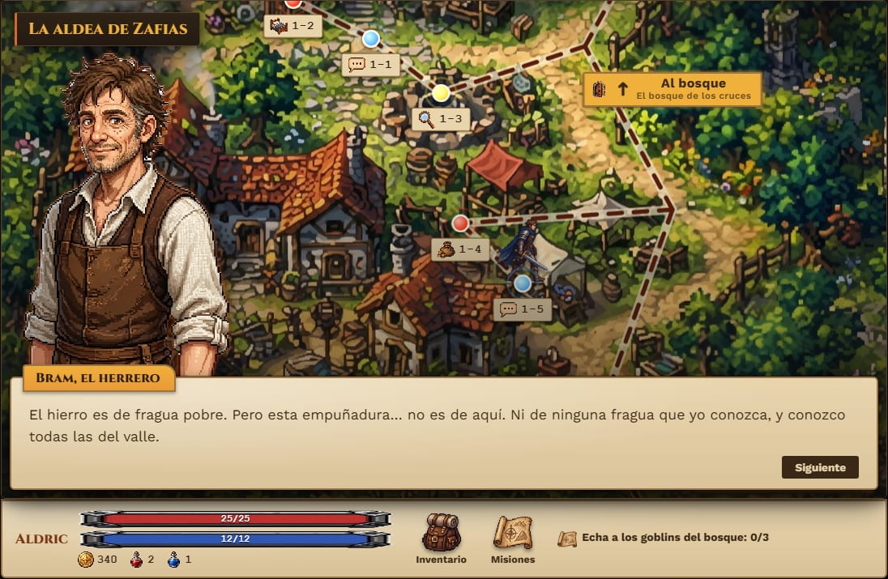
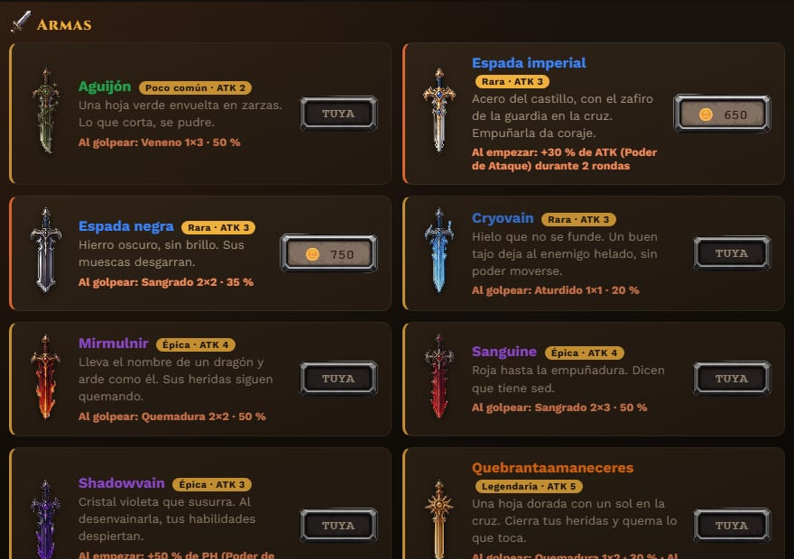

<div align="center">

# 🗡️ Easy Hero

### Despierta sin memoria. Explora Zafias. Pelea de tú a tú.

*Un RPG por turnos que se juega en el navegador, con el alma de los clásicos como DragonFable:
una aldea con sus vecinos y sus encargos, combates de lado, venenos y sangrados, armas que cambian a tu héroe…
y una pregunta que nadie en Zafias quiere responder: ¿quién eres?*

<br>


<br>

[](https://harmondez.github.io/easy_hero/)

<br>


[Novedades](#-novedades) · [La idea](#-la-idea) · [Zafias](#-zafias) · [El combate](#%EF%B8%8F-el-combate) · [Tu héroe](#%EF%B8%8F-tu-héroe) · [Estado](#-estado-del-juego) · [Qué viene](#-qué-viene)

</div>

---

## 🆕 Novedades

**Versión 1.9.3** · 2 de octubre de 2026 · [ver el registro completo de cambios](CHANGELOG.md)

> [!IMPORTANT]
> **Easy Hero es ya, entero, la aventura.** Los combates tienen venenos, sangrados y aturdimientos que se ven sobre
> cada personaje; tu héroe tiene maná y una barra de habilidades; el mercader de Zafias vende ocho espadas, cada una
> con su elemento y su efecto; y los vecinos te hablan cara a cara, como en una novela visual. Toda la historia,
> reescrita.

| | Qué hay de nuevo en la 1.9.3 |
|:-:|------------------|
| 💥 | **Golpes que se sienten:** números más grandes, en negrita y cursiva (rojos los que recibes, claros los que haces, dorados los críticos) y los efectos (veneno, sangrado…) aparecen justo en el impacto, con su icono |
| ⚡ | **La energía se guarda** de un combate a otro hasta 100; solo se vacía al dormir |
| ⚒️ | **La Forja, más clara:** Filo afilado, Constitución y Buen ojo desde 10 de oro, cada nivel da un punto más que el anterior (+1, +2, +3…) |
| 🧪 | **Tienda más barata:** poción a 20 y pan a 5 |
| 🐛 | **Arreglos:** los iconos de efecto ya no muestran a tu personaje en miniatura y los retratos no se cruzan al cambiar de conversación |

| | Lo que trajo la 1.9.2 |
|:-:|------------------|
| ⚡ | **Energía y Golpe poderoso:** una barra amarilla que se llena atacando, recibiendo golpes y, sobre todo, defendiéndote. Con 50 de energía, el **Golpe poderoso** pega el triple y puede aturdir al enemigo |
| 💫 | **Aturdido de verdad:** si te aturden, la barra se apaga, pierdes el turno solo y el enemigo aprovecha para actuar otra vez |
| ⏳ | **Combates con más peso:** embestidas más pausadas, golpes que hacen parpadear y temblar a quien los recibe, y una espera de 2 segundos en ¡Atacar! |
| ✨ | **Efectos más claros:** todos duran 3 rondas, con iconos grandes sobre cada personaje y, junto a la vida, la lista de lo que llevas |
| 🎭 | **Más caras:** Maela, los goblins y Grask (enorme) ya hablan con su retrato |
| ✍️ | **La historia, más llana:** todo el texto reescrito en el habla de un pueblo, sin frases de adorno. Y un mapa más limpio, sin carteles ni números |

| | Lo que trajo la 1.9.0 |
|:-:|------------------|
| ✨ | **Efectos de estado:** veneno, quemadura, sangrado, aturdido, más ATK, más PH y regeneración. Sus iconos flotan sobre quien los lleva, con las rondas que le quedan, y su daño salta en su color: verde el veneno, rojo el sangrado |
| 🐺 | **Enemigos con mala idea:** los goblins envenenan con sus cuchillos sucios, los lobos desgarran, Grask te aturde con su golpe fuerte y Feronius hace las dos cosas |
| 💧 | **Maná y barra de habilidades:** la **Bola de fuego** pega según tu **PH** (Poder de Habilidad) y el nuevo **Grito de guerra** sube tu ATK. Cuestan maná; dormir en la posada lo devuelve |
| ⚔️ | **El mercader vende armas:** ocho espadas, de 300 a 2000 de oro, cada una con su elemento y su efecto. Y el **cristal de mejora**, que añade ATK a tu arma para siempre |
| 🧪 | **Elixires, veneno y pan:** de fuerza, arcano y de hierbas para beber en combate, un frasco de veneno para lanzarlo al enemigo y pan para el camino |
| 🎒 | **Inventario al estilo DragonFable:** cada objeto con el color de su elemento y de su rareza, su imagen real en la ficha y tu héroe con él en la vista previa |
| 🎭 | **Diálogos de novela visual:** quien habla aparece de cuerpo entero sobre el cuadro de texto |
| ✍️ | **La historia, reescrita:** la introducción, los 80 diálogos de Zafias, las misiones y el bestiario. Y alguna pista sobre tu pasado |
| 🖼️ | **Arte en vez de emoticonos:** una barra de abajo como la de DragonFable, iconos dibujados en el menú, el mapa, el combate y la tienda, y botones de piedra en toda la página |
| 🗺️ | **La mazmorra, aparcada:** la cueva del sur está sellada… por ahora. Algo te dice que todavía no estás preparado |

<details>
<summary><b>📦 Lo que trajeron las versiones anteriores (1.6 – 1.8)</b></summary>

<br>

| | Qué hay de nuevo |
|:-:|------------------|
| 🌅 | **1.8.0 — Una introducción:** despiertas sin memoria en unas ruinas del bosque, recuerdas tu nombre, encuentras tu espada de hierro y caminas hasta Zafias |
| ⚔️ | **1.8.0 — La Espada de Zafias:** tráele a Bram cinco dientes de lobo y te forjará tu primera espada de verdad. Cada espada cambia el dibujo de tu héroe |
| 📜 | **1.8.0 — Diario de misiones:** la principal y las secundarias, con su progreso; las cumplidas, tachadas. Los NPC con encargo salen en azul |
| 🚪 | **1.7.1 — Salidas que se encuentran:** carteles dorados con flecha hacia cada salida, y criaturas a su tamaño |
| 🐺 | **1.7.0 — Feronius el Feroz, el jefe de Zafias:** vence a Grask y se abre la guarida del lobo |
| 🗺️ | **1.7.0 — Zafias en alta resolución:** el mapa rehecho y nítido, 28 paradas, lobos y puntos de interés con sorpresas |
| 🎨 | **1.6.0 — Enemigos con dibujo propio** y la fábrica de arte que los crea |

</details>

---

## ✨ La idea

> [!IMPORTANT]
> **Un héroe sin pasado y un mundo por descubrir.** Despiertas en unas ruinas con sangre seca en la frente, una espada
> de hierro y tu nombre. Todo lo demás —quién eres, qué arma llevas, en qué te conviertes— lo vas ganando en el camino.

Recorres Zafias **escena a escena** sobre un mapa pintado: hablas con sus vecinos, aceptas encargos, peleas **por
turnos y de lado**, como en DragonFable, y cada misión cumplida te deja algo que se queda contigo: oro, pociones o un
arma nueva que cambia el aspecto de tu héroe.

| 🌅 El comienzo | 🗺️ El mundo | ⚔️ El combate | 🎒 Tu héroe |
|:---:|:---:|:---:|:---:|
| Despiertas sin memoria | Zafias, escena a escena | Por turnos, de lado, con venenos y habilidades | Armas que se ven, nivel que no se pierde |

---

## 🧭 Zafias

Despiertas en unas ruinas del bosque, sin recordar cómo llegaste. Algo grande se mueve entre los helechos. Solo hay
un camino: el humo de las chimeneas del pueblo más cercano.

<p align="center">
  
</p>

**Zafias** es una aldea a las puertas de un bosque que los goblins han tomado. La recorres sobre un mapa pintado, como
los mapas antiguos: caminos **a trazos** entre paradas con su icono. Pulsa una parada y tu héroe irá
andando hasta allí… salvo que un enemigo le corte el paso. Abajo, siempre a la vista: tu vida, tu maná, tu bolsa y lo
que te toca hacer.

<p align="center">
  
</p>

- 🎭 **Vecinos que te hablan a la cara.** Cada conversación es una pequeña escena de novela visual. Los que tienen un
  encargo salen **en azul**: Maela, la posadera, quiere a los goblins fuera del bosque y a **Grask**, su jefe, muerto;
  Bram, el herrero, necesita cinco dientes de lobo. Todo queda en tu **diario de misiones**.
- ❔ **Una pregunta sin respuesta.** La misión principal es saber quién eres. Bram no reconoce la empuñadura de tu
  espada, las piedras del santuario parecen pronunciar tu nombre… y alguien está preguntando por ti.
- 👺 **Enemigos que ves venir.** Goblins y lobos esperan en los caminos. Si los vences desaparecen… hasta que duermes
  en la posada y vuelven.
- 🗺️ **Zonas que se abren.** El campamento goblin no aparece hasta que limpias el bosque, y la guarida del lobo no se
  abre hasta que cae Grask.
- 🔍 **Puntos de interés.** Un pozo, un fardo rajado en la orilla, una torre de vigía… algunos esconden oro o una
  poción la primera vez que los miras.
- 🐺 **El jefe de la zona.** Al fondo del barranco vive **Feronius el Feroz**, el lobo alfa: sangra, aturde y, herido,
  pierde la cabeza. Llega con pociones.
- 🏘️ **La aldea es tu base.** La **posada** te cura y te devuelve el maná; la **tienda** vende armas, elixires y
  mejoras. Si caes, despiertas allí con la bolsa más ligera.

<p align="center">
  
</p>

<p align="center">
  
</p>

---

## ⚔️ El combate

Peleas **de lado, cara a cara**: tu héroe a la izquierda y el enemigo a la derecha. Cada golpe es una embestida y el
daño salta sobre quien lo recibe. Abajo, en el panel de pergamino, están las dos vidas, tus acciones y tu barra de
habilidades.

| Acción | Qué hace |
|--------|----------|
| 🗡️ **¡Atacar!** | Golpeas con tu arma: tu **ATK** (Poder de Ataque) en daño, y el efecto de tu arma si lo tiene. Después, 2 segundos de espera |
| 🛡️ **Defender** | El próximo golpe que recibas hace la mitad, y recuperas energía |
| 🔥 **Habilidades** | En su barra, a un clic. La **Bola de fuego** (maná) hace tu **PH** (Poder de Habilidad) en daño; el **Grito de guerra** (maná) sube tu ATK un 50 % durante 3 rondas; el **Golpe poderoso** (50 de energía) pega el triple y puede aturdir |
| 🧪 **Pociones y elixires** | Vida, maná, fuerza, PH, regeneración… o un frasco de veneno para el enemigo. Gastan el turno |
| 🪽 **Huir** | Sales del combate, y te golpean al irte. De los jefes no se huye |

### ✨ Efectos de estado

| | Efecto | Qué hace |
|:-:|--------|----------|
| ☠️ | **Veneno** | Quita vida cada ronda, y se acumula |
| 🔥 | **Quemadura** | Quita vida cada ronda |
| 🩸 | **Sangrado** | Quita vida cada ronda |
| 💫 | **Aturdido** | Pierde su próximo turno, y el otro aprovecha |
| 💪 | **Más ATK** | Sus golpes pegan más |
| 🔮 | **Más PH** | Sus habilidades pegan más |
| 💚 | **Regeneración** | Recupera vida cada ronda |

Todos duran **3 rondas** (el aturdimiento, un turno). Sus iconos flotan sobre quien los lleva, con las rondas que le
quedan, y se listan junto a su vida. Al hacer efecto, el número salta en su color seguido de su icono.

#### 🌬️ Aprende a leer al enemigo

El enemigo **no anuncia** lo que va a hacer, como en los clásicos. Pero cada uno tiene su forma de pelear, y se le
nota: antes de un **golpe fuerte** se tensa y brilla en rojo, y una frase te avisa (*«Grask te mira fijo y no
parpadea.»*). Es el momento de defenderte. El **diario** del combate cuenta cada movimiento.

---

## 🛡️ Tu héroe

Empiezas con **ATK 1**, **PH 5**, **25 de vida** y **12 de maná**; la **energía** empieza a 0 y se guarda de un combate a otro hasta que duermes. Nada más. A partir de ahí depende de ti.

### 🎒 Tus armas

<p align="center">
  
</p>

Cada arma tiene su **rareza** (el color de su nombre), su **elemento** (el color de su icono) y, muchas, un
**efecto**: Aguijón envenena, Mirmulnir quema, Cryovain te deja al enemigo helado, Quebrantaamaneceres te cura al
empezar el combate… Bram te forja la **Espada de Zafias** si le traes cinco dientes de lobo; el resto las vende el
mercader, de **300 a 2000 de oro**, junto con el **cristal de mejora** (+1 ATK a tu arma, hasta +3). Cada espada con
dibujo propio cambia el aspecto de tu héroe, en el mapa y en el combate.

<p align="center">
  
</p>

### 🧬 Nivel y estadísticas primarias

Detrás de tu ATK y tu vida hay 4 números: **Fuerza, Destreza, Inteligencia y Vitalidad**. Ganas experiencia venciendo
combates, subes de nivel y **repartes tú mismo** los puntos.

| | Primaria | Qué da |
|:-:|----------|--------|
| 💪 | **Fuerza** | Daño físico y algo de vida |
| 🏹 | **Destreza** | Probabilidad de golpe **crítico** y de **esquivar** un golpe entero |
| 🧠 | **Inteligencia** | Daño elemental |
| ❤️ | **Vitalidad** | Vida máxima y resistencia física |

> [!IMPORTANT]
> **Nada de esto se pierde.** Tu nivel, tus armas, tu oro y tus pociones te acompañan siempre, aunque caigas.

---

## 🚧 Estado del juego

> [!NOTE]
> **Versión 1.9.3, sigue en desarrollo.** El foco es la **aventura**: Zafias se puede jugar de principio a fin, con
> Grask como primer muro y Feronius como jefe. La mazmorra sin fondo de las primeras versiones está aparcada (sigue
> en el código, pero no se puede entrar).

### ✅ Ya se puede jugar

- 🌅 **Una introducción**: despiertas sin memoria en unas ruinas, eliges tu nombre y caminas hasta Zafias
- 🧭 **Zafias**: aldea, bosque, campamento goblin y la guarida del lobo; 28 paradas, goblins, lobos y dos jefes
- 🎭 **Diálogos de novela visual** con retratos, y una historia con misterio
- 📜 **Misiones y diario**: la principal y las secundarias, con su progreso
- ⚔️ **Combate de lado** con embestidas, números de daño y enemigos que se aprenden
- ✨ **7 efectos de estado**, con su icono sobre cada personaje
- 💧 **Maná, PH y barra de habilidades**: Bola de fuego y Grito de guerra
- 🎒 **10 armas** con rareza, elemento y efecto, un inventario al estilo DragonFable y un héroe que cambia con su arma
- 🛒 **Tienda**: armas, cristales de mejora, pociones, elixires, veneno, pan y las mejoras permanentes de La Forja
- 🧬 **Nivel permanente y estadísticas primarias**, repartidas por ti
- 📖🎒🏆 **Bestiario, colección y logros**, desde el menú de arriba
- 💾 **Guardado automático**, y exportar o importar tu progreso desde Opciones
- 📱 Funciona en ordenador y en móvil

<details>
<summary><b>🕳️ La mazmorra sin fondo (aparcada)</b></summary>

<br>

Las primeras versiones de Easy Hero eran un descenso por una mazmorra sin fondo: rutas de 16 pisos con combates,
cofres, hogueras, **15 eventos** con dos decisiones, sub-jefes y un jefe; **90 monstruos** con **22 variantes**,
**122 objetos** de 5 rarezas en 4 ranuras, el trofeo legendario de cada jefe y una semilla por partida. Todo sigue en
el código y en sus comprobaciones, a la espera de volver… quizá detrás de la cueva del sur. Su diseño está en
[docs/eventos.md](docs/eventos.md) y [docs/equilibrio.md](docs/equilibrio.md).

</details>

---

## 🔮 Qué viene

> [!TIP]
> **Lo próximo:** más retratos para los diálogos (Maela, Grask, Feronius, los goblins); avanzar la misión principal
> —¿quién eres?—; más habilidades para la barra; el resto del equipo (armadura, casco, guantes, botas, anillos: ya
> tienen su icono); y un segundo mapa, **el bosque amarillo**, con **gnolls y orcos** ya dibujados y sus jefes
> **Gnarok** y **Guul, el rey orco**.

Todo lo que viene está explicado, con sus motivos, en **[planning.md](planning.md)**.

---

## 📚 Para saber más

| Documento | Qué cuenta |
|-----------|-----------|
| 📋 [planning.md](planning.md) | **Lo que queda por hacer**, y por qué |
| 📜 [historial.md](historial.md) | Lo ya decidido e implementado, en formato de log |
| 📜 [Registro de cambios](CHANGELOG.md) | Qué trae cada versión del juego |
| 🏷️ [Versiones](docs/versiones.md) | Cómo se numeran y se publican las versiones |
| 🗺️ [Zonas](docs/zonas.md) | Cómo se monta una zona nueva de la aventura |
| ⚖️ [Equilibrio](docs/equilibrio.md) | Cómo se ajusta la dificultad |
| 🔎 [Cómo funcionan los juegos de este género](jrpg-trend.md) | La investigación que guía el diseño |
| 🧪 [Cómo lo comprobamos](test-method.md) | Cómo verificamos que todo funciona |

---

## 🛠️ Para quien quiera colaborar

<details>
<summary><b>💻 Probarlo en tu ordenador</b></summary>

<br>

Necesitas tener **Node.js** y **Python** instalados. Desde la carpeta del proyecto:

```bash
npm run dev      # abre el juego en http://127.0.0.1:8770
```

Para probar armas y efectos sin gastar oro, pon `freeShop: true` en `src/data/balance.js`: la tienda lo da todo gratis.

</details>

<details>
<summary><b>✅ Comprobar que todo funciona</b></summary>

<br>

```bash
npm install                        # solo la primera vez
npx playwright install chromium    # solo la primera vez
npm test                           # ejecuta todas las comprobaciones
```

Son 1007 comprobaciones automáticas. Las de la lógica del juego tardan unos segundos; las del navegador, unos minutos.

Para ver cómo está el equilibrio de la aventura: `npm run sim:aventura` juega miles de partidas con un bot.

</details>

<details>
<summary><b>🎨 Añadir arte</b></summary>

<br>

```bash
npm run sprites   # héroes, enemigos, fondos y armas en la mano (img/entrantes → img/sprites, img/bg)
npm run icons     # iconos, objetos, marcos de interfaz y retratos (img/icons, img/items, img/weapons, img/characters → img/ui, img/portraits)
npm run vn        # novela visual: revisa diálogos y retratos; «nuevo» crea un NPC con su retrato y «ver» saca capturas
```

Receta para meter un NPC con su retrato y su diálogo: [docs/novela-visual.md](docs/novela-visual.md).

</details>

<details>
<summary><b>🏷️ Publicar una versión nueva</b></summary>

<br>

```bash
npm run release              # ¿está todo sincronizado con la versión actual?
npm run release -- patch     # 1.9.3 → 1.9.4  (también minor o major)
```

Cambia la versión en todos los sitios a la vez y prepara el registro de cambios. Los pasos completos están en [docs/versiones.md](docs/versiones.md).

</details>

<details>
<summary><b>📁 Qué hay en cada carpeta</b></summary>

<br>

```text
├── index.html      La página del juego
├── style.css       El aspecto
├── src/            La lógica del juego; el contenido (zonas, diálogos, misiones, armas…) en src/data/
├── img/            El arte del juego
├── tools/          Herramientas: arte, mapas, versiones
├── tests/          Las comprobaciones automáticas
└── docs/           Documentación e imágenes
```

</details>

---

<div align="center">

**[▶ Jugar ahora](https://harmondez.github.io/easy_hero/)** · Gratis · Sin instalar nada · En español

</div>
